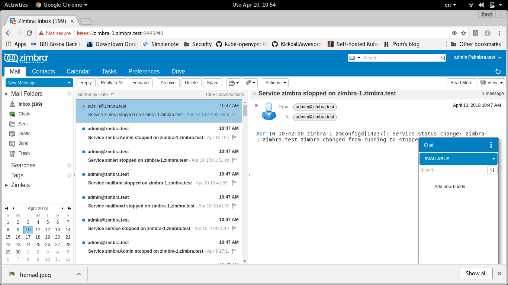

# usage

## Šta je šta

### ZIMBRA_VER

zimbra verzija (npr. 8.8.8, ili 8.8.9)

### ZIMBRA_IMG 

docker image koji sadrži zimbra software, npr. sadrži 8.8.9 sa patch 5

    export ZIMBRA_VER=8.8.9
    export ZIMBRA_IMG=hernad/zimbra_${ZIMBRA_VER}
    ./build_docker.sh

## ZIMBRA instance

operacijom kreiranja na osnovu nekog ZIMBRA_IMG se inicijalizira instanca (zimbra-1.zimbra.test) - inicijaliziraju se baze, ldap, konfiguracija.

Po uspješnom kreiranju instance docker volumeni zimbre sadrže potrebne podatke,
konfiguracija se snima u zimbra volumen DOCKER_ETC

## Inicijalizacija zimbra volumena

    setenforce 0
    #ZIMBRA_CLEANUP_VOLUMES=1 - pobrisati lokalne volumene
    export ZIMBRA_ADMIN_PASSWORD=test123
    export ZIMBRA_SERVICE_PASSWORD=zimbra
    export ZIMBRA_VER=8.8.9
    export ZIMBRA_IMG=hernad/zimbra_${ZIMBRA_VER}
    export ZIMBRA_INSTANCE_NAME=zimbra_i1
 
    ZIMBRA_CLEANUP_VOLUMES=1 ./create_zimbra_instance.sh

## Pokretanje zimbra instance

     export ZIMBRA_VER=8.8.9
     export ZIMBRA_IMG=hernad/zimbra_${ZIMBRA_VER}
     export ZIMBRA_INSTANCE_NAME=zimbra_i1
     ./run_zimbra_instance.sh
     docker logs $ZIMBRA_INSTANCE_NAME -f

## login

 

## diagnostics

     
     $ sudo docker exec -ti zimbra-88-instance

     # docker sesija
     root@706f7f6c0b15:/tmp/release# mount | grep log
     /dev/mapper/fedora-home on /opt/zimbra/log type ext4 (rw,relatime,seclabel,data=ordered)

zimbra client

https://127.0.0.1:8443

admin console:

https://127.0.0.1:7071/zimbraAdmin/

## upgrades

### fix-1

	mv zimbra/cmmmon zimbra/common

### upgrade 8.8.8 - 8.8.9

      
upgrade baze podataka i ldap-a:

    ./enter_into_zimbra_instance.sh
    # Release 8.8.8.GA.2009.UBUNTU16.64 UBUNTU16_64 FOSS edition.
    /init/upgrade/zimbra_88_89.sh

nakon toga koristiti zimbra image 8.8.9:

    export ZIMBRA_VER=8.8.9
    export ZIMBRA_IMG=hernad/zimbra_${ZIMBRA_VER}
    export ZIMBRA_INSTANCE_NAME=zimbra_i1
    ./run_zimbra_instance.sh
 

